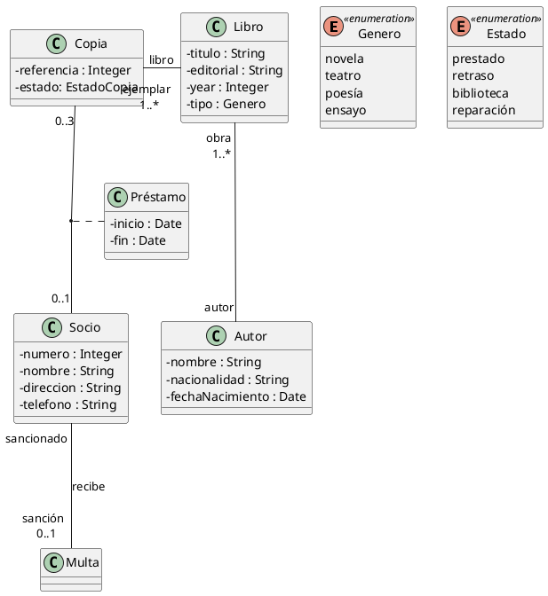
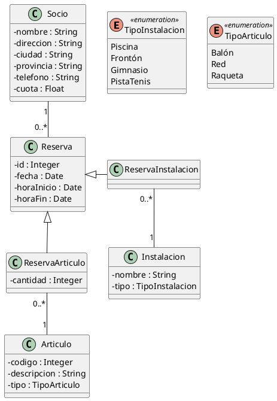

# JavaDoc

### Ejercicio 2. Biblioteca

Una aplicación necesita tener información sobre una biblioteca. Realiza el diagrama de clases y
añade los métodos necesarios para realizar el préstamo y devolución de libros.

La biblioteca tiene copias de libros. Estos últimos se caracterizan por su nombre, tipo (novela,
teatro, poesía, ensayo), editorial, año y autor.

Los autores se caracterizan por su nombre, nacionalidad y fecha de nacimiento.

Cada copia tiene un identificador, y puede estar en la biblioteca, prestada, con retraso o en
reparación.

Los lectores pueden tener un máximo de 3 libros en préstamo.

Cada libro se presta un máximo de 30 días, por cada día de retraso se impone una multa de dos días
sin posibilidad de coger un nuevo libro.

### Diagrama de clases generados con PlantUML

### Ejercicio 5. Instalaciones

Un centro de instalaciones deportivas quiere hacer una aplicación de reservas. En el centro existen
instalaciones deportivas (piscinas, frontones, gimnasios y pistas de tesis). El centro en cuestión tiene
socios, de los cuales se almacenan su nombre, dirección, ciudad, provincia, teléfono y cuota.
Además, existen una serie de artículos que se pueden reservar si el socio lo requiere (balones, redes
y raquetas). Cada instalación es reservada por un socio en una fecha dada desde una hora de inicio
hasta una hora de fin. Cada reserva puede tener asociada uno o varios artículos deportivos que se
alquilan a parte. Por ejemplo, si yo quiero hacer una reserva para jugar al tenis, tengo que reservar
una instalación polideportiva y si lo necesito, las raquetas.

### Diagrama de clases generados con PlantUML

