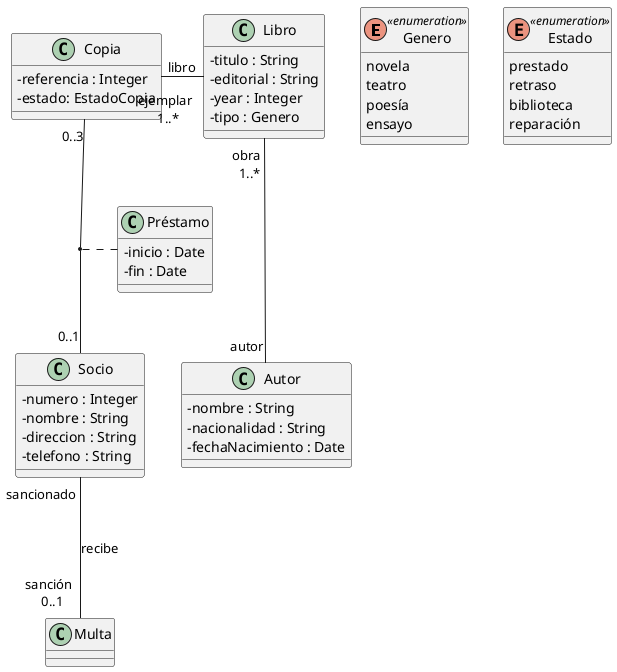

# JavaDoc

### Ejercicio 2. Biblioteca

Una aplicación necesita tener información sobre una biblioteca. Realiza el diagrama de clases y
añade los métodos necesarios para realizar el préstamo y devolución de libros.

La biblioteca tiene copias de libros. Estos últimos se caracterizan por su nombre, tipo (novela,
teatro, poesía, ensayo), editorial, año y autor.

Los autores se caracterizan por su nombre, nacionalidad y fecha de nacimiento.

Cada copia tiene un identificador, y puede estar en la biblioteca, prestada, con retraso o en
reparación.

Los lectores pueden tener un máximo de 3 libros en préstamo.

Cada libro se presta un máximo de 30 días, por cada día de retraso se impone una multa de dos días
sin posibilidad de coger un nuevo libro.

### Diagrama de clases generados con PlantUML

